# Bitacora
## Objetivo
Crear una bitácora con la que podrás agregar mensajes, imágenes, audio, video, ubicaciones y fechas.

### Integrantes:
- Betsy Vidal
- Araceli Cueva
- Melissa Yauri

## Herramientas
* Framework materialize
* File Api
* Api google maps
* Html5
* Jquery

## Entorno
El proyecto se trabajo en el sistema operativo Windows 10 (64 Bits).

## Flujo de la aplicación
1. Vista splash: Disponible por tres segundos

   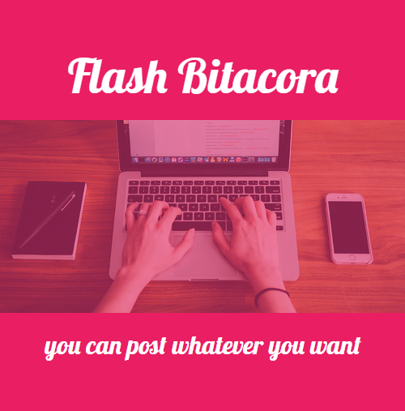

2. Vista general: La vista que te permite publicar lo que desees

   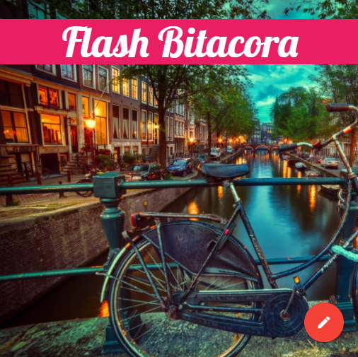

   - Y se puede publicar a traves de los botones para mensaje, imagen, video o audio y eventos

    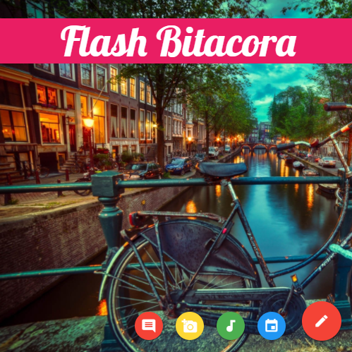

3. Publicaciones

   * Mensajes

    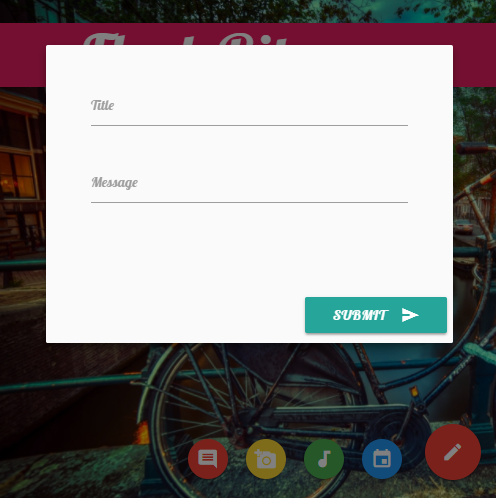

    

  * Fotos

    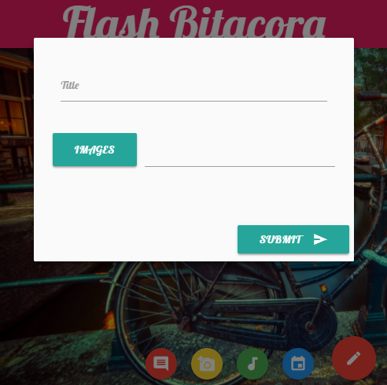

    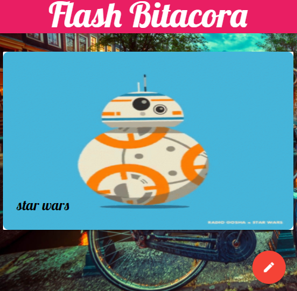

  * Audio o video
    - En esta sección puedes incorporar un audioo video con una breve descripción.

      - Video

      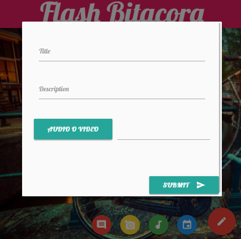

      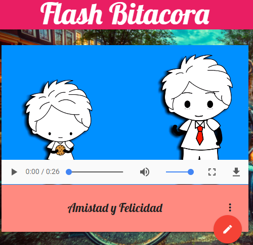

      - audio

      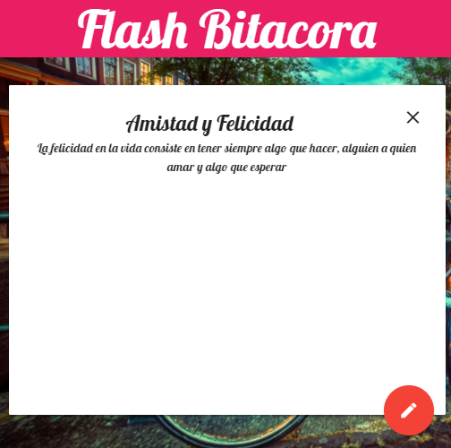

      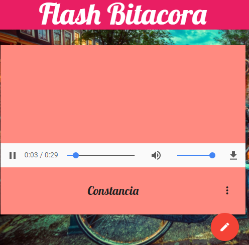

  * Evento
    - Te permite designar un título de tu evento y el día

      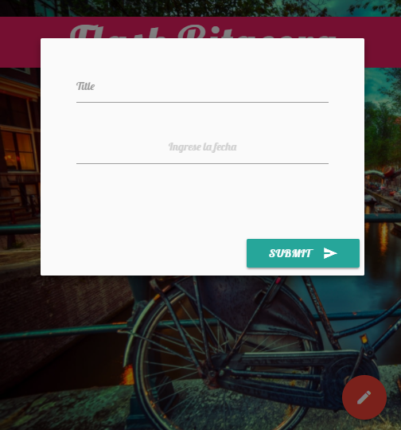

      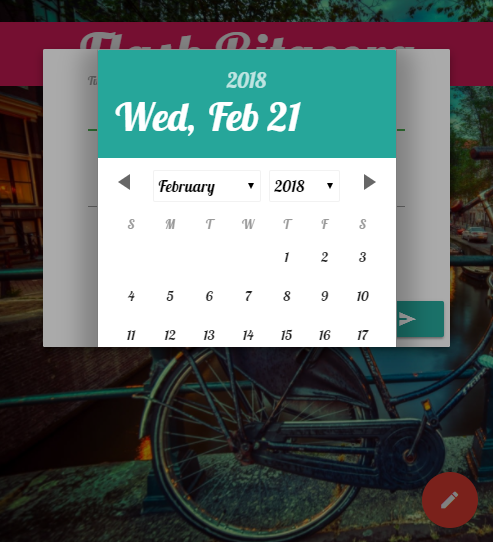

    - Asimismo se incorpora tu ubicación

      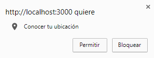

      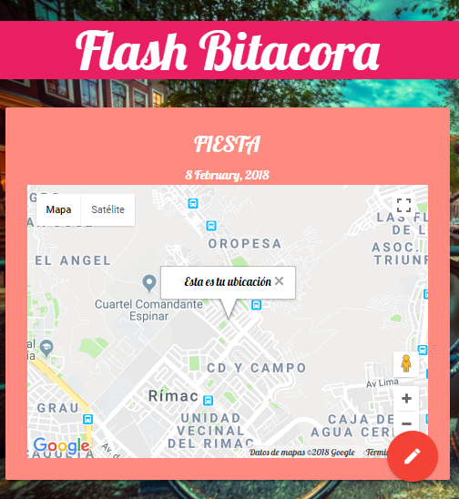
